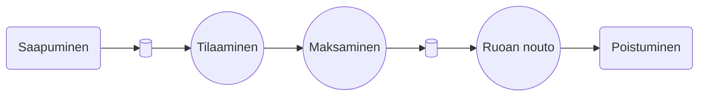
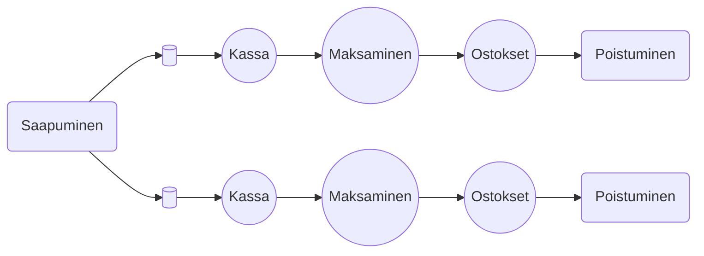

### Kaikki kirjoitustehtävät täällä

## Task 1

Esimerkkinä __Pankki__


 **Havaittavat muuttujat**

1. **A (Saapuneet asiakkaat)**
2. **C (Palvellut asiakkaat)**
3. **B (Palvelupisteen aktiivinen aika)** - Kokonaisaika, jonka pankkivirkailijat käyttävät asiakkaiden palvelemiseen.
4. **T (Simuloinnin kokonaisaika)**

**Johdetut muuttujat**

5. **U (Palvelupisteen käyttöaste)** - **U = B/T**, kertoo kuinka tehokkaasti virkailijat ovat käytössä.
6. **X (Palvelun läpäisykyky)**\* - ****X = C****\*/T\*\*, kertoo kuinka nopeasti asiakkaita palvellaan.
7. **S (Keskimääräinen palveluaika per asiakas)** - **S = B/C**, heijastaa, kuinka kauan yksi asiakas keskimäärin kestää palvella.

**Muita havaittavia muuttujia**

8. **R𝑖 (Yksittäisen asiakkaan vastausaika)** - Aika saapumisesta palvelun päättymiseen.
9. **W (Odotusaika, kumulatiivinen)** - Kaikkien asiakkaiden odotusaikojen summa.

**Lisäjohdetut muuttujat**

10. **R (Keskimääräinen vastausaika)** - **R = W/C**, asiakkaan keskimääräinen viipymä pankissa.
11. **N (Keskimääräinen jonon pituus)** - **N = W/T**, kertoo keskimääräisen asiakasmäärän pankissa.

**Simulaattorissa**

- Jos **U** on korkea, lisää virkailijoita voi olla tarpeen.
- Jos **R** on suuri, asiakkaat odottavat pitkään, mikä vaatii prosessiparannuksia.
- Jos **X** on matala, palvelu saattaa olla tehotonta.

## Task 2

Yleensä __performance measures__ ylläpidetään/päivitetään ja lasketaan kahdessa kategoriassa:

**1. Palvelupisteen suorituskykymittarit:**
- Ylläpitäminen: Mittarit (esim. käyttöaste, palveluaika) tallennetaan ja päivittyvät asiakkaan saapuessa ja palvelun edetessä.
- Päivittäminen: Mittarit, kuten palveluaika ja käyttöaste, päivittyvät jatkuvasti asiakasmäärän ja palvelun mukaan.
- Laskeminen: Johdetut mittarit (esim. läpimeno ja käyttöaste) lasketaan simulaation aikana asiakasmäärän ja palveluajan perusteella.

**2. Asiakkaan suorituskykymittarit:**
- Ylläpitäminen: Asiakkaan mittarit (esim. vastausaika, odotusaika) tallennetaan saapumisesta palvelun loppuun.
- Päivittäminen: Vastausaika päivittyy asiakkaan odotuksen ja palvelun keston mukaan.
- Laskeminen: Odotusaika (W) ja vastausaika (R) lasketaan ja käytetään keskimääräisten arvojen laskemiseen simulaation aikana.

#### __Siksi juuri lasketaan muuttujat erikseen palvelupisteen ja asiakkaan näkökulmasta.__


## Task 3

```Pikaruokala esimerkki:```

--- 
```Ruokakauppa esimerkki:  -> Normi ja itsepalvelukassa```


## Task 4

